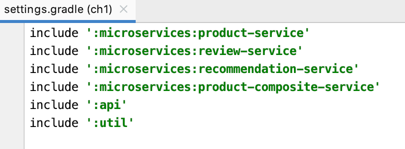
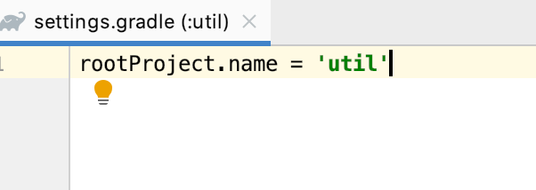
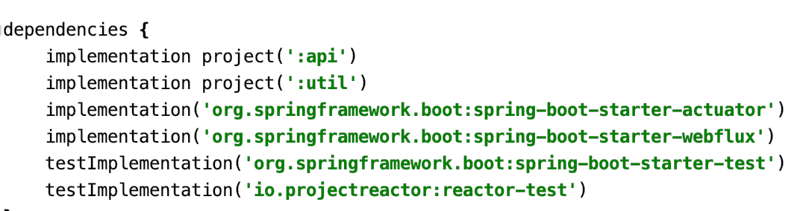
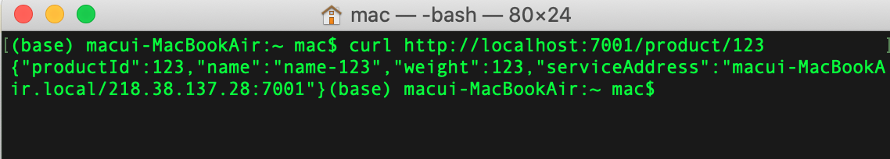
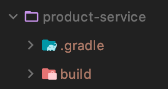
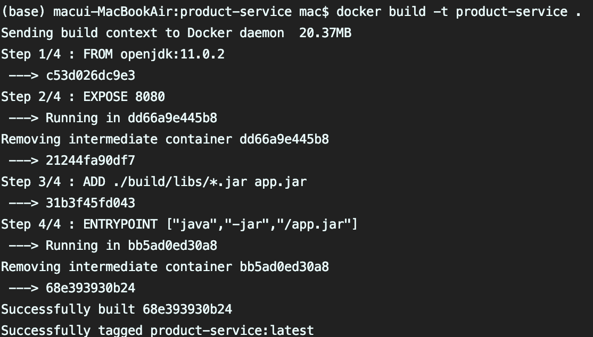
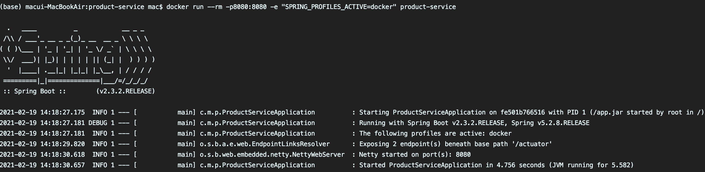
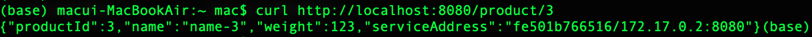

# Spring boot MSA 적용해보기 

---

1. gradle에 멀티 프로젝트 빌드 설정 하기

#### root의 settings.gradle 주목.





#### 각각의 모듈에도 settings.gradle로 name을 정해준다.





다른 모듈의 service단이나 util을 사용하고 싶으면 build.gradle에서 추가해준다.





잘 적용이 되었는지 확인해본다.
참고로 저는 터미널에서 curl 을 사용하여 요청을 보내보았습니다.

> `` curl http://localhost:7001/product/123  `` 요청 (밑에 결과 화면)




> `` curl http://localhost:7000/product-composite/1 `` 요청 (밑에 결과 화면)
>


- docker 이용해보기

docker를 이용하여 spring을 가동해보겠습니다.
일단 스프링에 설정에 profiles를 추가하여 docker로 실행할때 옵션을 따로 주었습니다.

> application.yml

``` 
---
spring.profiles: docker
server.port: 8080
```

를 추가해 주시고, product-service 모듈에 **Dockerfile** 에 빌드에 사용될 java나 포트, 빌드 폴더, 도커에 사용될 커맨드 등을 입력한다.

Dockfile를 생성해주면 root project 에서 gradle 빌드를 해준다.

```aidl
gradle :microservices:product-service:build
```

[결과화면]



product-service로 지정한 도커 이미지를 빌드한다.

```aidl
docker build -t product-service .
```



이미지가 제대로 적용이 되었으면 도커로 실행을 시킨다.

```aidl
docker run --rm -p8080:8080 -e "SPRING_PROFILES_ACTIVE=docker" product-service
```



작동이 잘 되는지 get 요청을 보내봅니다.

```aidl
curl http://localhost:8080/product/3
```



