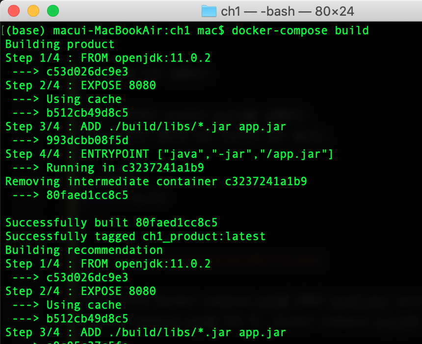
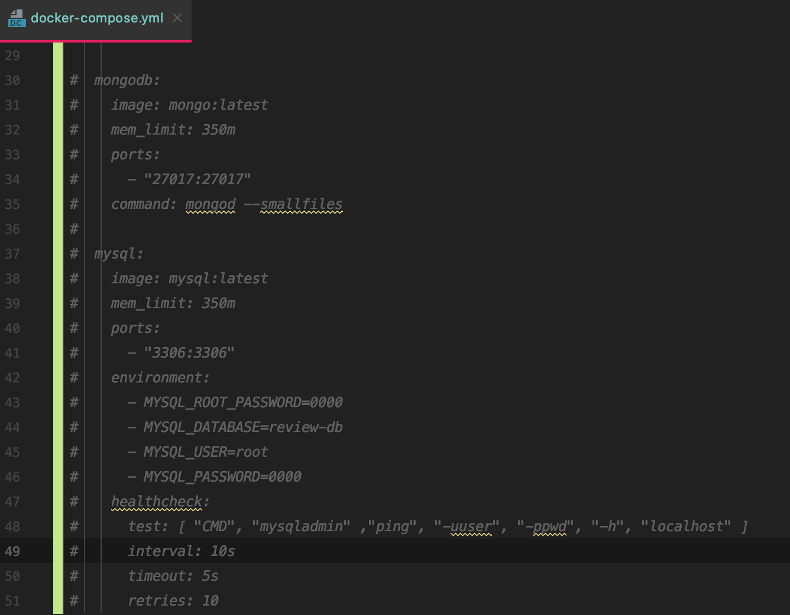

# Spring boot MSA 적용해보기 

---

1. gradle에 멀티 프로젝트 빌드 설정 하기

#### root의 settings.gradle 주목.


#### 각각의 모듈에도 settings.gradle로 name을 정해준다.


다른 모듈의 service단이나 util을 사용하고 싶으면 build.gradle에서 추가해준다.


잘 적용이 되었는지 확인해본다.
참고로 저는 터미널에서 curl 을 사용하여 요청을 보내보았습니다.

> `` curl http://localhost:7001/product/123  `` 요청 (밑에 결과 화면)


> `` curl http://localhost:7000/product-composite/1 `` 요청 (밑에 결과 화면)
>


- docker 이용해보기

docker를 이용하여 spring을 가동해보겠습니다.
일단 스프링에 설정에 profiles를 추가하여 docker로 실행할때 옵션을 따로 주었습니다.

> application.yml

``` 
---
spring.profiles: docker
server.port: 8080
```

를 추가해 주시고, product-service 모듈에 **Dockerfile** 에 빌드에 사용될 java나 포트, 빌드 폴더, 도커에 사용될 커맨드 등을 입력한다.

Dockfile를 생성해주면 root project 에서 gradle 빌드를 해준다.

```aidl
gradle :microservices:product-service:build
```

[결과화면]


product-service로 지정한 도커 이미지를 빌드한다.

```aidl
docker build -t product-service .
```


이미지가 제대로 적용이 되었으면 도커로 실행을 시킨다.

```aidl
docker run --rm -p8080:8080 -e "SPRING_PROFILES_ACTIVE=docker" product-service
```


작동이 잘 되는지 get 요청을 보내봅니다.

```aidl
curl http://localhost:8080/product/3
```


> 컨테이너 분리모드

d 옵션을 사용해 분리 모드로 컨테이너를 시작하고, --name 옵션으로 컨테이너의 이름을 지정한다.
컨테이너를 사용한 후에는 직접 컨테이너를 중지하고 제거할 것이므로 더는 --rm 옵션이 필요없다.

```shell script
docker run -d -p8080:8080 -e "SPRING_PROFILES_ACTIVE=docet" --name my-prd-srv product-service
```

실행 후, docker의 상태를 보면 실행된것을 볼 수 있다.

```shell script
docker ps
```


컨테이너의 로그를 보려면 어떻게 해야 할까?
도커의 log 커맨드를 사용한다.

```shell script
docker logs my-prd-srv -f
```


-f 옵션은 터미널에 로그가 출력되는 동안 커맨드를 종료하지 않고, 계속해서 로그를 출력하게 된다.
  
--tail 0 옵션을 추가해 새로운 로그 메세지만 표시할수 있다.
--since 옵션에 타임스탬프나 상대 시간을 입력하면 된다. ex) --since 5m를 사용하면 5분 전의 로그 메시지를 볼 수 있다.

컨테이너를 중지하고, 제거하고 마무리를 하자.
```shell script
docker rm -f my-prd-srv
```

- 한꺼번에 도커 실행하기

최상위 루트에서 gradle build를 실행한다.
마이크로서비스 폴더에 있는 모든것이 빌드 됩니다.

```shell
gradle build
```


최상위 루트에 docker-compose.yml를 만들어 profile나 port 와 관련된 정보를 적습니다.
docker-compose.yml를 만든 뒤, docker-compose build로 빌드 시킨다.

```shell
docker-compose build
```



그 다음 docker-compose up -d 로 실행 시키고 docker-compose logs -f 로 로그를 볼 수 있습니다.


- swagger 사용해보기

라이브러리를 받고, 설정을 하여 사용중인 api를 문서화 할 수 있다.


api 문서를 보기 위해서는 `http://localhost:8080/swagger-ui/index.html` 로 연결하면 볼 수 있다.
> swagger2 2.9 이하의 버전에서는 localhost:8080/swagger-ui.html 에서 볼 수 있었습니다.
  


- db 설정

db를 설정할려면 application.yml에 db정보를 입력하면 설정을 할 수 있다.


위에처럼 mongodb 와 mysql 를 설정할 수 있다.

docker-compose.yml에 docker image를 설정하여 DB를 도커로 만들수있지만 저는 docker에 미리 만들어 놓은게 있어 주석 처리하고 진행했습니다.



이후, docker-compose로 실행 후 도커를 보면 추가한 api를 볼 수 있다.

